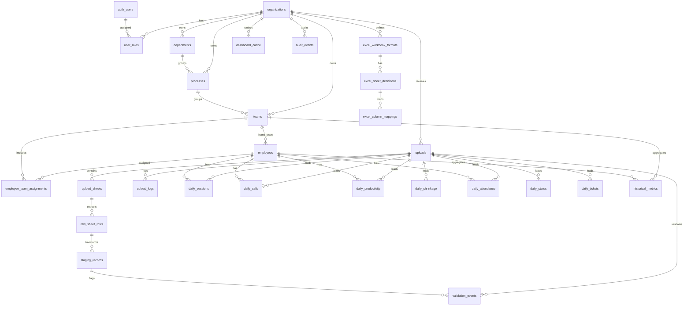

# Enterprise WFM Database Architecture

This design makes PostgreSQL/Supabase the source of truth. Excel files are only import payloads. The ETL pipeline persists raw extraction data, normalized staging records, validation evidence, business facts, aggregates, dashboard cache, and audit history.

## Table Design

### Identity And Access

`organizations` exists for tenancy and future scale. Every business table belongs to an organization.

Columns: `id`, `name`, `slug`, `timezone`, `is_active`, `created_at`, `updated_at`.

`user_profiles` extends `auth.users` with display metadata.

Columns: `id`, `display_name`, `email`, `is_active`, `created_at`, `updated_at`.

`user_roles` maps Supabase users to organization roles.

Columns: `id`, `organization_id`, `user_id`, `role`, `created_at`.

Relationships: `user_roles.organization_id -> organizations.id`, `user_roles.user_id -> auth.users.id`.

### Master Data Dimensions

`departments` stores business departments.

Columns: `id`, `organization_id`, `name`, `code`, `is_active`, `created_at`, `updated_at`.

`processes` stores operational queues/processes under departments.

Columns: `id`, `organization_id`, `department_id`, `name`, `code`, `is_active`, `created_at`, `updated_at`.

`teams` stores teams/LOBs and manager ownership.

Columns: `id`, `organization_id`, `department_id`, `process_id`, `name`, `code`, `manager_user_id`, `is_active`, `created_at`, `updated_at`.

`shifts` stores reusable shift windows and grace rules.

Columns: `id`, `organization_id`, `name`, `code`, `start_time`, `end_time`, `grace_minutes`, `timezone`, `is_active`, `created_at`, `updated_at`.

`employees` stores one row per agent/employee, independent from Excel spelling.

Columns: `id`, `organization_id`, `employee_code`, `external_agent_id`, `display_name`, `email`, `department_id`, `process_id`, `home_team_id`, `default_shift_id`, `manager_employee_id`, `hire_date`, `termination_date`, `is_active`, `created_at`, `updated_at`.

`employee_team_assignments` keeps historical team movement.

Columns: `id`, `organization_id`, `employee_id`, `team_id`, `effective_from`, `effective_to`, `created_at`.

### Mapping Layer

`excel_workbook_formats` versions workbook layouts.

Columns: `id`, `organization_id`, `name`, `version`, `description`, `is_active`, `created_at`, `updated_at`.

`excel_sheet_definitions` defines expected sheets and parser ownership.

Columns: `id`, `workbook_format_id`, `sheet_key`, `expected_sheet_name`, `parser_name`, `metric_type`, `is_required`, `created_at`, `updated_at`.

`excel_column_mappings` maps Excel headers to internal fields.

Columns: `id`, `sheet_definition_id`, `excel_header`, `internal_field`, `data_type`, `is_required`, `default_value`, `transform_rule`, `created_at`, `updated_at`.

### ETL Control Plane

`uploads` is the import batch header. It tracks file identity, duplicate detection, storage path, status, counts, and timing.

Columns: `id`, `organization_id`, `workbook_format_id`, `uploaded_by`, `report_date`, `file_name`, `file_hash`, `file_size_bytes`, `storage_bucket`, `storage_path`, `status`, `row_count`, `warning_count`, `error_count`, `started_at`, `completed_at`, `error_message`, `created_at`, `updated_at`.

`upload_sheets` records each worksheet discovered in a workbook.

Columns: `id`, `upload_id`, `sheet_definition_id`, `sheet_name`, `sheet_index`, `raw_row_count`, `parsed_row_count`, `status`, `created_at`, `updated_at`.

`raw_sheet_rows` stores extracted sheet rows as raw JSON arrays.

Columns: `id`, `upload_id`, `upload_sheet_id`, `row_number`, `raw_values`, `raw_hash`, `created_at`.

`staging_records` stores transformed normalized JSON before fact loading.

Columns: `id`, `upload_id`, `upload_sheet_id`, `raw_sheet_row_id`, `metric_type`, `row_number`, `normalized_record`, `record_hash`, `is_valid`, `created_at`.

`upload_logs` stores pipeline stage logs.

Columns: `id`, `upload_id`, `stage`, `level`, `message`, `details`, `created_at`.

`validation_events` stores row-level and field-level validation evidence.

Columns: `id`, `upload_id`, `upload_sheet_id`, `staging_record_id`, `severity`, `code`, `message`, `field_name`, `raw_value`, `details`, `created_at`.

### Operational Facts

`daily_attendance` stores one attendance record per employee/date.

Columns: `id`, `organization_id`, `upload_id`, `employee_id`, `work_date`, `team_id`, `shift_id`, `scheduled_start`, `scheduled_end`, `first_login_at`, `last_logout_at`, `attendance_status`, `late_minutes`, `login_minutes`, `source_record_id`, `created_at`, `updated_at`.

`daily_sessions` stores login/ready/break session facts.

Columns: `id`, `organization_id`, `upload_id`, `employee_id`, `work_date`, `team_id`, `login_at`, `logout_at`, `ready_minutes`, `break_minutes`, `idle_minutes`, `session_minutes`, `source_record_id`, `created_at`, `updated_at`.

`daily_calls` stores call handling facts.

Columns: `id`, `organization_id`, `upload_id`, `employee_id`, `work_date`, `team_id`, `offered_count`, `answered_count`, `abandoned_count`, `handle_seconds`, `hold_seconds`, `source_record_id`, `created_at`, `updated_at`.

`daily_productivity` stores calculated productivity measures.

Columns: `id`, `organization_id`, `upload_id`, `employee_id`, `work_date`, `team_id`, `ready_minutes`, `break_minutes`, `handling_minutes`, `occupancy_pct`, `utilization_pct`, `productivity_pct`, `source_record_id`, `created_at`, `updated_at`.

`daily_shrinkage` stores team/process/date shrinkage facts.

Columns: `id`, `organization_id`, `upload_id`, `work_date`, `department_id`, `process_id`, `team_id`, `scheduled_count`, `present_count`, `leave_count`, `week_off_count`, `shrinkage_count`, `shrinkage_pct`, `is_rollup`, `source_record_id`, `created_at`, `updated_at`.

`daily_status` stores status-duration facts such as ready, break, idle, training, meeting.

Columns: `id`, `organization_id`, `upload_id`, `employee_id`, `work_date`, `status_code`, `status_minutes`, `occurrence_count`, `source_record_id`, `created_at`, `updated_at`.

`daily_tickets` stores ticket/workbench productivity facts.

Columns: `id`, `organization_id`, `upload_id`, `employee_id`, `work_date`, `team_id`, `opened_count`, `closed_count`, `resolution_minutes`, `source_record_id`, `created_at`, `updated_at`.

### Read Models, Cache, Reports, Audit

`historical_metrics` stores reusable aggregate snapshots by grain.

Columns: `id`, `organization_id`, `metric_date`, `grain`, `department_id`, `process_id`, `team_id`, `employee_id`, `metrics`, `created_at`, `updated_at`.

`dashboard_cache` stores API-ready JSON cache blobs.

Columns: `cache_key`, `organization_id`, `payload`, `refreshed_at`.

`report_exports` tracks generated report files.

Columns: `id`, `organization_id`, `requested_by`, `report_type`, `filters`, `storage_path`, `status`, `created_at`, `completed_at`.

`audit_events` records inserts, updates, and deletes on business-critical tables.

Columns: `id`, `organization_id`, `actor_user_id`, `action`, `entity_table`, `entity_id`, `old_values`, `new_values`, `request_id`, `ip_address`, `created_at`.

`excel_rows`, `daily_summary`, and `agent_day_summary` are compatibility/read-model tables for the current dashboard API. They can be retired after the API reads from normalized facts and `historical_metrics`.

## Relationships

- Organization owns roles, dimensions, uploads, facts, aggregates, reports, cache, and audit events.
- User belongs to organizations through `user_roles`.
- Department has many processes and teams.
- Process has many teams.
- Team has many employees through `employees.home_team_id` and historical `employee_team_assignments`.
- Upload has many sheets, raw rows, staging records, logs, validations, and facts.
- Raw row has zero or one staging record.
- Staging record can feed one or more fact rows through `source_record_id`.
- Facts reference dimensions: employee, team, process, department, shift.
- Aggregates reference the same dimensions at a declared grain.

## Excel Data Flow

1. User uploads workbook.
2. File metadata and hash are inserted into `uploads`.
3. File is stored in Supabase Storage under `excel-files`.
4. Workbook sheets are inserted into `upload_sheets`.
5. Every row from every sheet is inserted into `raw_sheet_rows` as raw JSON.
6. Parser and mapping rules from `excel_sheet_definitions` and `excel_column_mappings` transform raw rows into `staging_records`.
7. Validation writes issues to `validation_events` and stage messages to `upload_logs`.
8. Valid staging rows are loaded into dimensions if needed, then facts:
   - Session Details -> `daily_sessions`, `daily_attendance`, `daily_status`
   - ACD Calls / Call Details -> `daily_calls`
   - Prod Summary -> `daily_productivity`
   - Shrinkage -> `daily_shrinkage`
   - Ticket Closure / Workbench -> `daily_tickets`
9. Calculations write derived KPIs to fact tables and `historical_metrics`.
10. Dashboard API refresh writes ready-to-serve payloads to `dashboard_cache`.
11. Critical changes are captured in `audit_events`.

## ER Diagram



## Indexing Strategy

Primary query indexes are organization/date/employee or organization/date/team on every fact table. Upload-stage tables are indexed by `upload_id` and stage/status. Employee lookup is indexed by `(organization_id, employee_code)` and `(organization_id, external_agent_id)`. Aggregate reads are indexed by `(organization_id, metric_date, grain)`.

For high volume, add monthly partitions to `raw_sheet_rows`, `staging_records`, and fact tables by `created_at` or `work_date`. Keep `historical_metrics` and `dashboard_cache` small and hot.

## RLS Strategy

RLS is enabled on all application tables.

- `viewer`: read organization-scoped business data.
- `manager`: read and write operational data, uploads, reports, and mappings.
- `admin`: all manager rights plus role management.
- `service_role`: bypasses RLS for server ETL jobs and API routes.

Compatibility tables intentionally have RLS enabled with no direct browser policies. The existing app reads them through server-side API routes using the Supabase service role.

## Migration

Run:

```sql
-- Supabase SQL editor
-- paste/run supabase/migrations/202607060001_enterprise_wfm_schema.sql
```

This migration is additive and keeps the existing dashboard read-model tables. The next backend step is to update the ETL loader so each parsed sheet writes raw rows, staging records, normalized dimensions, operational facts, and aggregate metrics.
